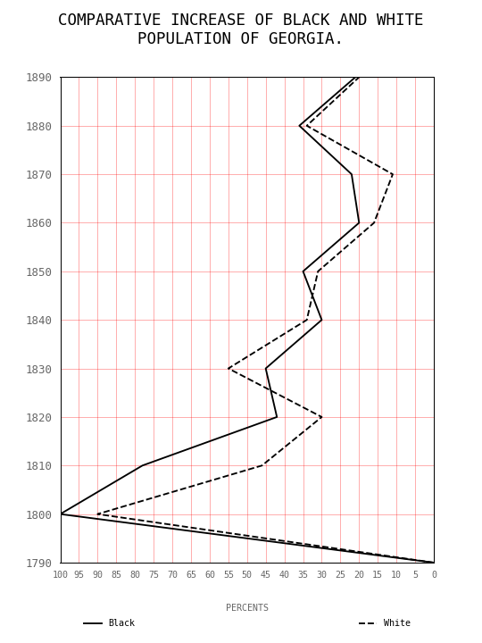
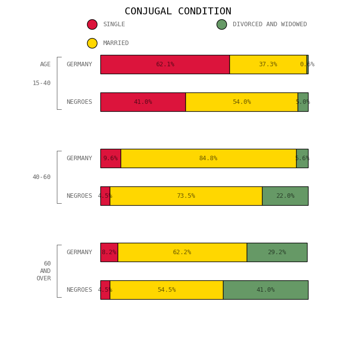

# thirty-days

***Daily (or almost) data visualisations with python.***

Inspired by a [challenge](https://github.com/ajstarks/dubois-data-portraits/tree/master/challenge) to recreate some of Du Bois's classic visualisations.
1. Comparing two time series with a vertical orientation and a reversed axis.

2. Using a multiindex table and creating 6 horizontal stacked bar plots.

